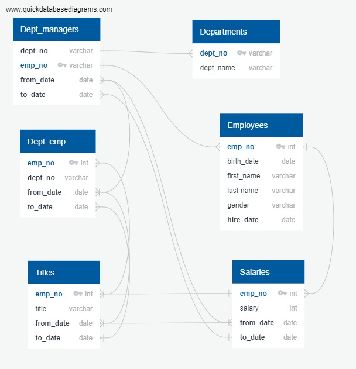
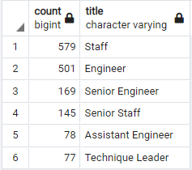

# Pewlett-Hackard-Analysis

## **Overview of Project**

The purpose of this analysis is to conduct a detailed Database analysis for Pewlett Hackard showing the number of future retirees across departments, in order to strategize hiring new staff and begin a mentorship initiative. 

The criterion was based on the birth dates ranging from 1952 to 1955 and hired dates from 1985 to 1988.

## Results

- Below is the ERD (Entity Relationship Diagram) used to visualize the relationship between the data sources and the structure of the company's employee plan to facilitate the analysis. 

	

### Future Job Openings 

- Looking at the data, we can see many employees of retirement age currently hold senior titles (57,668/90,398) or **64%** of the staff to retire. Below is a table of the retirees, sorted by their titles. 

	

### Mentorship Candidates
- Below are those employees who qualify for the mentorship program – these are senior employees in the general staff, not quite at retirement age. As you can see, there are not many of them.

	
	

## Summary

- Currently, with 90,398 employees of retirement age employees in senior positions, Pewlett Hackard should begin looking for new roles in many positions, meaning an aggressive hiring campaign with a steady flow of new talented hires to fill the positions for any of the who are

- Now at Pewlett Hackard, **64%** of their employees are getting ready for retirement or being redirected to their mentorship initiatives, which will mean that they are likely going to need an extensive hiring process in the upcoming years. Since a significant amount of future retirees hold Senior positions the mentorship program should provide a capacitation buffer for the extensive expertise that will be leaving the company in the years to come. 

- Alongside recruitment, the mentorship plan could help some of the younger workers advance into senior roles. Unfortunately, the number of those eligible to mentor (employees born during 1965,) represent a mere 1% of those reaching retirement age. This means that the recruitment campaign needs to be extensive, as well as retention focused. A component of the mentorship program should also be to reinvest into itself, perhaps expanding its age requirements to a lower age to prevent further issues due to an aging staff.

- This “silver tsunami” will certainly affect their workforce. With such a large amount of staff reaching retirement age, and especially considering that over half are in senior positions, the effect on their workforce will be massive. Even as they are able to fill all of their positions, the gap between experience and the work that needs to be done will cause a bumpy road to stability. PH’s small and dedicated mentorship group will also face some struggles when establishing a new culture, but as long as all employees new and old can create a clear plan-of-attack, this ship will sail smoothly again in no time.

## Resources

**Data Sources:** departments.csv, dept_emp.csv, dept_manager.csv, employees.csv, salaries.csv, titles.csv

**Software:** SQL, PostgreSQL, pgAdmin
